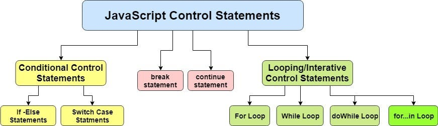

# Control Flow in JavaScript: Understanding if and switch Statements
<p align="center">

</p>

Control flow is a fundamental concept in programming, and in JavaScript, it determines the order in which statements are executed. By using control flow constructs, we can make our programs dynamic and responsive to different conditions. Two essential tools for controlling flow in JavaScript are the if statement and the switch statement.
## The Role of Control Flow
**Control flow allows us to execute specific blocks of code based on certain conditions. For example:**
_Decision-making:_ Choose between different paths in your code based on the evaluation of expressions.
_Flexibility:_ Handle dynamic input and adapt to varying scenarios.
_Readability:_ Organize your code logically, making it easier to follow and debug.

###### Let's explore if and switch statements, their syntax, and their use cases. 🚀

## The if Statement
The if statement is one of the most commonly used tools for decision-making in JavaScript. It evaluates a condition and executes a block of code if the condition is true.
_Syntax_
```javascript
if (condition) {
    // Code to execute if condition is true
} else if (anotherCondition) {
    // Code to execute if anotherCondition is true
} else {
    // Code to execute if none of the above conditions are true
}
```
**Example**:
```javascript
let temperature = 30;

if (temperature > 35) {
  console.log("It's very hot! 🌞");
} else if (temperature >= 20 && temperature <= 35) {
  console.log("The weather is pleasant. 🌤️");
} else {
  console.log("It's cold. ❄️");
}
```
### When to Use
Use if statements when:
- You need to evaluate complex conditions.
- The number of possible outcomes is small and manageable.
- Conditions are not based on a single value comparison.

## The switch Statement
The switch statement is another decision-making tool, often used as a cleaner alternative to multiple if-else conditions when comparing a single value against different cases.
_Syntax_
```javascript
switch (expression) {
  case value1:
    // Code to execute if expression equals value1
    break;
  case value2:
    // Code to execute if expression equals value2
    break;
  default:
    // Code to execute if expression doesn't match any case
}
```
Example
```javascript
let day = "Tuesday";

switch (day) {
  case "Monday":
  case "Tuesday":
    console.log("Start of the work week. 💼");
    break;
  case "Saturday":
  case "Sunday":
    console.log("It's the weekend! 🎉");
    break;
  default:
    console.log("Midweek vibes. 🌈");
}
```
### When to Use
Use switch statements when:

- You need to compare a single expression against multiple possible values.

- The logic involves exact matches rather than complex conditions.

- You want to improve readability by avoiding multiple if-else blocks.

## Key Differences Between if and switch

| Feature     | if Statement                                                  | switch Statement                                       |
|-------------|---------------------------------------------------------------|--------------------------------------------------------| 
| Condition Type | Handles complex conditions (e.g., ranges, logical operators). | Compares a single expression to specific values.    | 
| Readability | Can become cluttered with many else if.                       | Cleaner and more organized for multiple discrete cases.|
| Flexibility | Highly flexible with various expressions.                     | Limited to equality checks.                            |
| Performance | May be slower for many conditions.                            | Can be faster for a large number of discrete cases.    |

## Best Practices

Choose the right tool: Use if for complex conditions and switch for comparing a single value against multiple discrete options.

Avoid fall-through in switch: Always use break unless you explicitly want execution to "fall through" to the next case.

Keep it readable: Avoid deeply nested if statements and overly long switch cases.

Combine with functions: Extract large code blocks into separate functions for better maintainability.

## Conclusion
Both if and switch are essential tools for controlling the flow of a program in JavaScript. Understanding their differences and knowing when to use each will help you write cleaner, more efficient, and more readable code. Mastering these control flow constructs is a vital step toward becoming a proficient JavaScript developer. 💻
