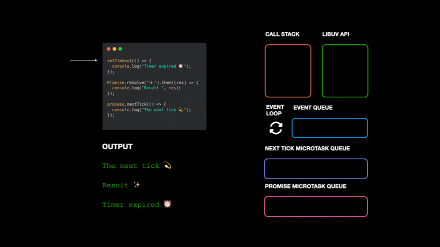

<p align="center">

</p>

### Synchronous and Asynchronous in JavaScript
JavaScript is known for its ability to handle both synchronous and asynchronous operations. Understanding how these two things work is important for writing efficient, responsive, and user-friendly applications. In this article, we will see the differences between synchronous and asynchronous JavaScript with clear examples to help you.
### What is Synchronous JavaScript?
In synchronous programming, operations are performed one after the other, in sequence. So, basically each line of code waits for the previous one to finish before proceeding to the next. This means that the program executes in a predictable, linear order, **with each task being completed before the next one starts**.

Example: In this example, we have shown the synchronous nature of JavaScript.
```javascript
console.log("Hi");
console.log("Geek");
console.log("How are you?");
```
**Output**
```
Hi
Geek
How are you?
```
In the above code snippet, the first line of the code Hi will be logged first then the second line Geek will be logged and then after its completion, the third line will be logged How are you. So as we can see the codes work in a sequence. Every line of code waits for its previous one to get executed first and then it gets executed.

In synchronous code, every statement waits for the previous one to finish before it runs. This is straightforward and easy to follow, but it has some drawbacks, especially when dealing with time-consuming tasks like fetching data from a server or reading a large file. If such a task is included in the sequence, it will block the execution of the rest of the code until it’s finished, leading to potential delays and a bad user experience.

---

### What is Asynchronous JavaScript?

Asynchronous programming, on the other hand, allows multiple tasks to run independently of each other. In asynchronous code, a task can be initiated, and while waiting for it to complete, other tasks can proceed. This non-blocking nature helps improve performance and responsiveness, especially in web applications.

Example: In this example, we have shown the Asynchronous nature of JavaScript.
```javascript
console.log("Hi");

setTimeout(() => {
    console.log("Geek");
}, 2000);

console.log("End");

```
**Output**
```
Hi
End
Geek
```
So, what the code does is first it logs in Hi then rather than executing the setTimeout function it logs in End and then it runs the setTimeout function.

At first, as usual, the Hi statement got logged in. As we use browsers to run JavaScript, there are the web APIs that handle these things for users. So, what JavaScript does is, it passes the setTimeout function in such web API and then we keep on running our code as usual. So it does not block the rest of the code from executing and after all the code its execution, it gets pushed to the call stack and then finally gets executed. This is what happens in asynchronous JavaScript.
### How Asynchronous JavaScript Works Behind the Scenes

<p align="center">

</p>

>[!NOTE]
>To understand asynchronous behavior better, it’s important to know about the JavaScript runtime environment, 
> specifically the event loop and call stack:


1. Call Stack: The call stack is where functions are executed in the order they’re called. In synchronous operations, each function is added to the stack and executed before moving to the next.
2. Web APIs (in Browsers): Functions like setTimeout, HTTP requests, and event listeners are handled by Web APIs in the browser. When an asynchronous function like setTimeout is called, it is passed to these Web APIs, which manage the timing without blocking the main call stack.
3. Callback Queue: Once the Web API has finished its job (like waiting for the timeout), it pushes the callback function (like the one in setTimeout) to the callback queue.
4. Event Loop: The event loop continuously checks the call stack. If it’s empty, it pushes the functions from the callback queue onto the stack for execution. This is why the delayed message “Geek” is logged after other code has finished.