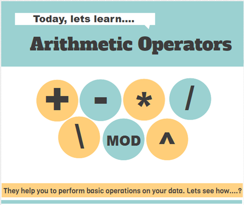

<div align="center">

</div>
### JavaScript Arithmetic Operators
JavaScript Arithmetic Operators are the operator that operate upon the numerical values and return a numerical value.
Arithmetic operators in JavaScript are used to perform mathematical operations on numbers. These operators include:

 1. [Addition (+)](01-addition.js);
 2. [Subtraction (-)](02-subtraction.js)
 3. [Multiplication (*)](03-multiplication.js) 
 4. [Division(/)](04-division.js)
 5. [Modulus(%)](05-exponentiation.js)
 6. [Exponentiation(**)](06-modulus.js)
 7. [Increment (++)](06-modulus.js)
 8. [Decrement (--)](06-modulus.js)
 9. [Assignment](09-Assignment.js)
10. [Unary Plus ](010-Unary-Plus.js)
11. [Unarry Negation ](011-Unary-Negation.js)
12. [Type-Coercion ](012-Type-Coercion.js)
13. [operators challenge ](OperatorsChallenge.js)

### Unary plus (+)
The unary plus (+) operator precedes its operand and evaluates to its operand but attempts to convert it into a number, if it isn't already.
### unary negation (-)
Although unary negation (-) also can convert non-numbers, unary plus is the fastest and preferred way of converting something into a number, because it does not perform any other operations on the number.
>[!IMPORTANT]
>Unary plus does the exact same steps as normal number coercion used by most built-in methods expecting numbers. It 
 can convert string representations of integers and floats, as well as the non-string values true, false, and null. Integers in both decimal and hexadecimal (0x-prefixed) formats are supported. Negative numbers are supported (though not for hex). If it cannot parse a particular value, it will evaluate to NaN. Unlike other arithmetic operators, which work with both numbers and BigInts, using the + operator on BigInt values throws a TypeError.

**Examples**
~~Usage with numbers~~
```javascript
const x = 1;
const y = -1;

console.log(+x);
// 1
console.log(+y);
// -1

```
~~Usage with non-numbers~~
```javascript
+true  // 1
+false // 0
+null  // 0
+[]    // 0
+function (val) { return val; } // NaN
+1n    // throws TypeError: Cannot convert BigInt value to number

```

### Challenges 
1. Basic Arithmetic Operators
- Write a function calculate(a, b) that returns the sum, difference, product, and quotient of two numbers.
 ```calculate(10, 5);
 // Expected output: { sum: 15, difference: 5, product: 50, quotient: 2 }
 ```
2. Comparison Operators
- Create a function compareNumbers(a, b) that:
- Returns "greater" if a is greater than b.
- Returns "less" if a is less than b.
- Returns "equal" if a is equal to b.
 ```
 compareNumbers(8, 10);
 // Expected output: "less"
 ```
3. Logical Operators
- Write a function canVote(age, hasID) that checks if a person can vote:
- The person must be at least 18 years old.
- The person must have an ID.
 ```javascript
 canVote(20, true);
 // Expected output: true
 ```
4. Bitwise Operators
- Given two numbers a and b, write a function bitwiseAnd(a, b) to return their bitwise AND value.
```javascript
  bitwiseAnd(5, 3);
  // Expected output: 1 (0101 & 0011 = 0001)
```
5. Ternary Operator
   - Write a function isEven(num) using the ternary operator that returns:
   - "even" if the number is even.
   - "odd" if the number is odd.
```javascript
isEven(4); 
// Expected output: "even"
```
6. Assignment Operators
- Create a function updateScore(score) that:
- Adds 10 to score if it’s less than 50.
- therwise, subtracts 5 from score.
```javascript
updateScore(45); 
// Expected output: 55
```
7. String Operators
- Write a function concatenateWords(word1, word2) that joins two strings using the + operator.
```javascript
concatenateWords("Hello", "World");
// Expected output: "HelloWorld"
```
8. Unary Operators
   - Write a function getOppositeSign(num) that returns the negative of a number using the unary - operator.
```javascript
getOppositeSign(15);
// Expected output: -15
```
9. Challenge Bonus: Precedence
- Analyze the following expression and write a function evaluateExpression() to compute its result:
```javascript
const result = 5 + 3 * 2 - (8 / 4) ** 2;
```


