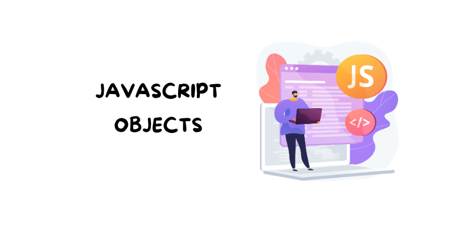

<p align="center">

</p>

## JavaScript Objects
The Object type represents one of JavaScript's data types. It is used to store various keyed collections and more 
complex entities. Objects can be created using the Object() constructor or the object initializer / literal syntax {}.
## Description
Nearly all objects in JavaScript are instances of Object; a typical object inherits properties (including methods) from Object.prototype, although these properties may be shadowed (a.k.a. overridden). The only objects that don't inherit from Object.prototype are those with null prototype, or descended from other null prototype objects.
Changes to the Object.prototype object are seen by all objects through prototype chaining, unless the properties and methods subject to those changes are overridden further along the prototype chain. This provides a very powerful although potentially dangerous mechanism to override or extend object behavior. To make it more secure, Object.prototype is the only object in the core JavaScript language that has immutable prototype — the prototype of Object.prototype is always null and not changeable.

## Object initializer {}
An object initializer is an expression that describes the initialization of an Object. Objects consist of properties, which are used to describe an object. The values of object properties can either contain primitive data types or other objects.
is a comma-delimited list of zero or more pairs of property names and associated values of an object, enclosed in 
curly braces ({}). Objects can also be initialized using Object.create() or by invoking a constructor function with the new operator.
```javascript
const object1 = { a: 'foo', b: 42, c: {} };

console.log(object1.a);
// Expected output: "foo"

const a = 'foo';
const b = 42;
const c = {};
const object2 = { a: a, b: b, c: c };

console.log(object2.b);
// Expected output: 42

const object3 = { a, b, c };

console.log(object3.a);
// Expected output: "foo"
```
> [!IMPORTANT]
> The object literal syntax is not the same as the JavaScript Object Notation (JSON). Although they look similar, 
> there are differences between them:

## Object prototype properties
You should avoid calling any Object.prototype method directly from the instance, especially those that are not intended to be polymorphic (i.e. only its initial behavior makes sense and no descending object could override it in a meaningful way). All objects descending from Object.prototype may define a custom own property that has the same name, but with entirely different semantics from what you expect. Furthermore, these properties are not inherited by null-prototype objects. All modern JavaScript utilities for working with objects are static. More specifically:
 - valueOf(), toString(), and toLocaleString() exist to be polymorphic and you should expect the object to define 
   its own implementation with sensible behaviors, so you can call them as instance methods. However, valueOf() and toString() are usually implicitly called through type conversion and you don't need to call them yourself in your code. 
 - __defineGetter__(), __defineSetter__(), __lookupGetter__(), and __lookupSetter__() are deprecated and should not be used. Use the static alternatives Object.defineProperty() and Object.getOwnPropertyDescriptor() instead.
 - The __proto__ property is deprecated and should not be used. The Object.getPrototypeOf() and Object.setPrototypeOf() alternatives are static methods.
 - The propertyIsEnumerable() and hasOwnProperty() methods can be replaced with the Object.getOwnPropertyDescriptor() and Object.hasOwn() static methods, respectively.
 - The isPrototypeOf() method can usually be replaced with instanceof, if you are checking the prototype property of a constructor.

In case where a semantically equivalent static method doesn't exist, or if you really want to use the Object.prototype method, you should directly call() the Object.prototype method on your target object instead, to prevent the object from having an overriding property that produces unexpected results.
```javascript
const obj = {
  foo: 1,
  // You should not define such a method on your own object,
  // but you may not be able to prevent it from happening if
  // you are receiving the object from external input
  propertyIsEnumerable() {
    return false;
  },
};

obj.propertyIsEnumerable("foo"); // false; unexpected result
Object.prototype.propertyIsEnumerable.call(obj, "foo"); // true; expected result
```
 
## Deleting a property from an object
> [!NOTE]
> There isn't any method in an Object itself to delete its own properties (such as Map.prototype.delete()). To do so, one must use the delete operator.

## null-prototype objects
Almost all objects in JavaScript ultimately inherit from Object.prototype. However, you may create null-prototype objects using Object.create(null) or the object initializer syntax with __proto__: null (note: the __proto__ key in object literals is different from the deprecated Object.prototype.__proto__ property). You can also change the prototype of an existing object to null by calling Object.setPrototypeOf(obj, null).
```javascript
const obj = Object.create(null);
const obj2 = { __proto__: null };
```
>[!NOTE]
> An object with a null prototype can behave in unexpected ways, because it doesn't inherit any object methods from Object.prototype. This is especially true when debugging, since common object-property converting/detecting utility functions may generate errors, or lose information (especially if using silent error-traps that ignore errors).

For example, the lack of Object.prototype.toString() often makes debugging intractable:
```javascript
const normalObj = {}; // create a normal object
const nullProtoObj = Object.create(null); // create an object with "null" prototype

console.log(`normalObj is: ${normalObj}`); // shows "normalObj is: [object Object]"
console.log(`nullProtoObj is: ${nullProtoObj}`); // throws error: Cannot convert object to primitive value

alert(normalObj); // shows [object Object]
alert(nullProtoObj); // throws error: Cannot convert object to primitive value
// Other methods will fail as well.

normalObj.valueOf(); // shows {}
nullProtoObj.valueOf(); // throws error: nullProtoObj.valueOf is not a function

normalObj.hasOwnProperty("p"); // shows "true"
nullProtoObj.hasOwnProperty("p"); // throws error: nullProtoObj.hasOwnProperty is not a function

normalObj.constructor; // shows "Object() { [native code] }"
nullProtoObj.constructor; // shows "undefined"

```
>[!WARNING]
Modifying the prototype property of any built-in constructor is considered a bad practice and risks forward compatibility.


