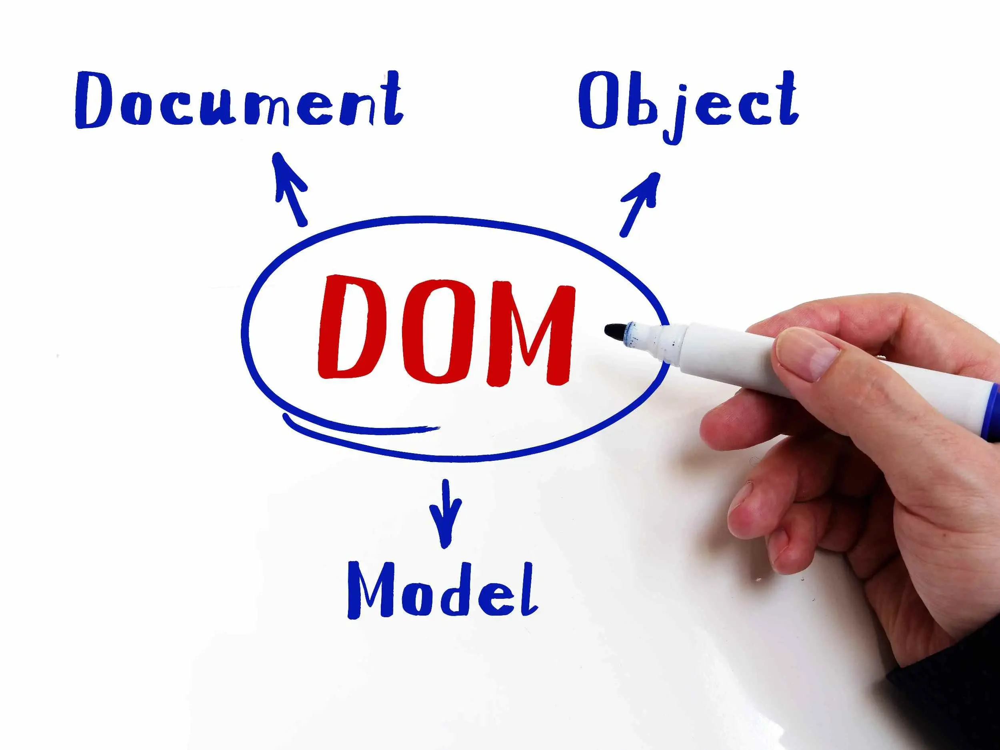

<figure>
    
    <figcaption>DOCUMENT OBJECT MODULE</figcaption>
</figure>

### Introduction to the DOM

The Document Object Model, commonly referred to as the DOM, is a fundamental concept for anyone working with web development. It serves as a bridge between web pages and programming languages like JavaScript, allowing developers to interact with and manipulate the structure, content, and styling of a webpage dynamically.

### What is the DOM?
The Document Object Model (DOM) is a programming interface for web documents. It represents the page so that programs can change the document structure, style, and content. The DOM represents the document as nodes and objects; that way, programming languages can interact with the page.

A web page is a document that can be either displayed in the browser window or as the HTML source. In both cases, it is the same document but the Document Object Model (DOM) representation allows it to be manipulated. As an **object-oriented representation** of the web page, it can be modified with a scripting language such as JavaScript.

For example, the DOM specifies that the querySelectorAll method in this code snippet must return a list of all the <p> elements in the document:
```javascript
const paragraphs = document.querySelectorAll("p");
// paragraphs[0] is the first <p> element
// paragraphs[1] is the second <p> element, etc.
alert(paragraphs[0].nodeName);

```
All of the properties, methods, and events available for manipulating and creating web pages are organized into objects. For example, the document object that represents the document itself, any table objects that implement the HTMLTableElement DOM interface for accessing HTML tables, and so forth, are all objects.

The DOM is built using multiple APIs that work together. The core DOM defines the entities describing any document and the objects within it. This is expanded upon as needed by other APIs that add new features and capabilities to the DOM. For example, the HTML DOM API adds support for representing HTML documents to the core DOM, and the SVG API adds support for representing SVG documents.
### DOM and JavaScript

The previous short example, like nearly all examples, is JavaScript. That is to say, it is written in JavaScript, but uses the DOM to access the document and its elements. The DOM is not a programming language, but without it, the JavaScript language wouldn't have any model or notion of web pages, HTML documents, SVG documents, and their component parts. The document as a whole, the head, tables within the document, table headers, text within the table cells, and all other elements in a document are parts of the document object model for that document. They can all be accessed and manipulated using the DOM and a scripting language like JavaScript.

The DOM is not part of the JavaScript language, but is instead a Web API used to build websites. JavaScript can also be used in other contexts. For example, Node.js runs JavaScript programs on a computer, but provides a different set of APIs, and the DOM API is not a core part of the Node.js runtime.

The DOM was designed to be independent of any particular programming language, making the structural representation of the document available from a single, consistent API. Even if most web developers will only use the DOM through JavaScript, implementations of the DOM can be built for any language, as this Python example demonstrates:
```python
# Python DOM example
import xml.dom.minidom as m
doc = m.parse(r"C:\Projects\Py\chap1.xml")
doc.nodeName # DOM property of document object
p_list = doc.getElementsByTagName("para")
```
### How the DOM Works: A Step-by-Step Guide
To understand how the DOM works, we need to explore the process behind it.
#### 1. The Browser Loads the HTML
When you open a webpage, the browser fetches the HTML file from the server and begins processing it. This step involves parsing the HTML document line by line, turning it into the DOM structure.
#### 2. Parsing and Building the DOM Tree
The browser parses the HTML document and creates a DOM tree, a hierarchical structure that represents all the elements in the document. During this process:
- Elements: Each HTML tag (like <div> or ) becomes a node in the tree.
- Attributes: Attributes like class or id are added to the corresponding nodes.
- Text: Any content inside tags becomes text nodes.
For example, given this HTML:
```html
<!DOCTYPE html>
<html>
  <head>
    <title>My Page</title>
  </head>
  <body>
    <h1>Hello!</h1>
    <p>Welcome to the DOM.</p>
  </body>
</html>

```
**The browser converts it into this DOM tree:**

```graphql
Document
 └── html
      ├── head
      │    └── title
      └── body
           ├── h1
           └── p
```
#### 3. Connecting the DOM to the CSSOM
After parsing the HTML, the browser also processes the CSS (Cascading Style Sheets) and creates another structure called the CSSOM (CSS Object Model). The CSSOM defines the styles applied to each DOM element.
Once the DOM and CSSOM are built, the browser combines them into a render tree, which is used to visually display the webpage.
#### 4. JavaScript and DOM Manipulation
The real power of the DOM comes from JavaScript. Once the DOM tree is built, JavaScript can access, modify, or remove nodes in the DOM. This happens dynamically, meaning changes are reflected immediately in the browser.
`For example:`
**Accessing Elements:**
```javascript
const heading = document.querySelector('h1');
console.log(heading.textContent); // Output: Hello!
```
**Modifying Elements:**
```javascript
heading.textContent = 'Welcome!';
```
**Adding Elements:**
```javascript
const newParagraph = document.createElement('p');
newParagraph.textContent = 'This was added dynamically!';
document.body.appendChild(newParagraph);
```
#### 5. Event-Driven Updates
The DOM works seamlessly with events, allowing webpages to respond to user interactions like clicks, typing, or scrolling.
How It Works: When an event occurs (e.g., a button click), the browser notifies JavaScript. You can use an event listener to define what happens when an event occurs.

Example:
```javascript
const button = document.querySelector('button');
button.addEventListener('click', () => {
  alert('You clicked the button!');
});

```
#### 6. Reflow and Repaint
When the DOM is updated (e.g., by adding or modifying elements), the browser needs to reprocess the render tree. This triggers:

- Reflow: Recalculating the layout of the webpage.
- Repaint: Updating the visual representation.
_For example:_

If you add new content, the browser performs reflow to adjust the layout.
If you only change the color of a button, the browser performs repaint, which is faster since it doesn't involve layout recalculations.
#### 7. APIs for Working with the DOM
The browser provides several APIs (Application Programming Interfaces) to interact with the DOM:
Document API: Access and manipulate the DOM (document.getElementById, document.querySelector).
Node API: Work with nodes (node.appendChild, node.removeChild).
Event API: Add event listeners (addEventListener).
>[!NOTE] 
>
### Conclusion
Understanding the DOM is essential for creating interactive and responsive web applications. While the DOM can seem complex initially, practice and experimentation will help you master it. The more you dive into the DOM, the better you'll understand how browsers and web pages work together.


### What Is a Web API?
>[!IMPORTANT]
> If You have already Read My First section Of js Basics you will say that's I' repeating this parte
> related to WEB API Bcs it's so important and it's take me some time to understand the relation betwen Web API and
> Js so let's go in it and let's explain it again and again
---

A Web API (Application Programming Interface) is a set of **pre-defined interfaces or functions provided by the browser** (or web environment) that allows developers to interact with the browser, manipulate the DOM, handle user interactions, and even communicate with servers.
In simple terms, Web APIs are tools provided by the browser to make JavaScript more powerful and enable it to interact with web pages and external systems.
### Key Categories of Web APIs
#### 1.  DOM APIs
- Used to manipulate the structure, content, and styling of web pages.
- Example: document.querySelector(), createElement(), getElementById().
- Purpose: Enable JavaScript to dynamically update HTML and CSS.
Example:
```javascript
const heading = document.querySelector('h1');
heading.textContent = 'Hello, Web APIs!';
```
#### 2.Event APIs
- Help handle user interactions (like clicks, typing, scrolling).
- Example: addEventListener, removeEventListener
Example:
```javascript
document.querySelector('button').addEventListener('click', () => {
  alert('Button Clicked!');
});
```
#### 3.Fetch and HTTP APIs
- Enable communication between the browser and a server.
- Example: fetch() for making network requests.
Example:
```javascript
fetch('https://api.example.com/data')
  .then((response) => response.json())
  .then((data) => console.log(data));
```
#### 4.Storage APIs
- Allow you to store data on the client-side for persistence.
- Example: localStorage, sessionStorage, IndexedDB.
Example
```javascript
localStorage.setItem('theme', 'dark');
console.log(localStorage.getItem('theme')); // Output: dark
```
#### 5.Graphics and Multimedia APIs
- For working with multimedia content (images, videos) or rendering graphics.
- Example: Canvas API, WebGL, MediaDevices.
Example:
```javascript
const canvas = document.querySelector('canvas');
const ctx = canvas.getContext('2d');
ctx.fillStyle = 'blue';
ctx.fillRect(50, 50, 100, 100);
```
#### 6.Geolocation API
- Accesses the user's location.
- Example: navigator.geolocation.
Example
```javascript
navigator.geolocation.getCurrentPosition((position) => {
  console.log('Latitude:', position.coords.latitude);
  console.log('Longitude:', position.coords.longitude);
});
```
#### 7.Web Workers
- Enable running JavaScript in the background, separate from the main thread, to improve performance.
Example
```javascript
const worker = new Worker('worker.js');
worker.postMessage('Hello Worker');
worker.onmessage = (event) => {
  console.log(event.data);
};
```
#### 8.WebSockets API
- Enables real-time communication between the browser and a server.
- Example: Used in chat apps, live notifications.
Example:
```javascript
const socket = new WebSocket('ws://example.com/socket');
socket.onmessage = (event) => {
  console.log('Message from server:', event.data);
};
```
### How JavaScript Uses Web APIs to Interact with the DOM
1. Accessing Elements JavaScript uses DOM APIs to access and manipulate elements in the document.
Example:
```javascript
const title = document.getElementById('main-title');
console.log(title.textContent); // Logs the text inside the element
```
2. Manipulating Styles DOM APIs also allow changing styles dynamically.
Example:
```javascript
const box = document.querySelector('.box');
box.style.backgroundColor = 'red';
```
3. Responding to Events JavaScript listens for events like clicks or keypresses and performs actions.
Example
````javascript
document.querySelector('input').addEventListener('input', (e) => {
  console.log('You typed:', e.target.value);
});
````
4. Animating Elements APIs like requestAnimationFrame() allow for smooth animations.
Example 
```javascript
let position = 0;
function moveBox() {
  position += 1;
  document.querySelector('.box').style.left = position + 'px';
  if (position < 300) requestAnimationFrame(moveBox);
}
moveBox();
```
### The Relationship Between JavaScript, Web APIs, and the Browser
1. JavaScript Code: Your JavaScript code runs in the browser's JavaScript engine (like V8 in Chrome).
2. Web APIs: The browser provides APIs that JavaScript can call to interact with the web page, server, or user 
   environment.
3. Callback Queue: When an event (like a button click) is triggered, it gets added to the callback queue, and the 
   event loop ensures it gets executed in the right order.
   
### What You Need to Know as a Web Developer
1. Understand the Browser Environment
- JavaScript runs within the browser's sandbox.
- Web APIs are built into the browser and are accessible globally (e.g., document, window).

2. Learn Core APIs Focus on frequently used APIs:
- DOM APIs (document.querySelector, createElement).
- Fetch (fetch() and handling promises).
- Event APIs (addEventListener).

3. Optimize Performance
- Avoid too many DOM manipulations.
- Use techniques like debounce or throttle for event-heavy tasks (e.g., scrolling or resizing).
Security

4. Be cautious with APIs that handle sensitive data, like Geolocation.
- Sanitize inputs to prevent cross-site scripting (XSS).
Browser Compatibility

5. Some APIs may not work in older browsers. Use tools like Can I Use or fallbacks for compatibility.
Practice!

6. Build small projects that use Web APIs (e.g., a to-do list app, a weather app using Fetch, or a canvas-based 
drawing app).

### Summary
Web APIs are the building blocks that allow JavaScript to interact with the browser, server, and user environment. They cover a broad range of capabilities, from DOM manipulation to real-time communication and multimedia handling. As a web developer, mastering these APIs will enable you to create dynamic, interactive, and responsive web applications.


