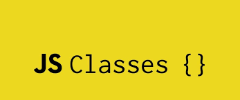

### object-oriented programming

JavaScript is a prototype-based language — an object's behaviors are specified by its own properties and its prototype's properties. However, with the addition of classes, the creation of hierarchies of objects and the inheritance of properties and their values are much more in line with other object-oriented languages such as Java. In this section, we will demonstrate how objects can be created from classes.

In many other languages, classes, or constructors, are clearly distinguished from objects, or instances. In JavaScript, classes are mainly an abstraction over the existing prototypical inheritance mechanism — all patterns are convertible to prototype-based inheritance. Classes themselves are normal JavaScript values as well, and have their own prototype chains. In fact, most plain JavaScript functions can be used as constructors — you use the new operator with a constructor function to create a new object.

We will be playing with the well-abstracted class model in this tutorial, and discuss what semantics classes offer. If you want to dive deep into the underlying prototype system, you can read the Inheritance and the prototype chain guide.

This chapter assumes that you are already somewhat familiar with JavaScript and that you have used ordinary objects.

Overview of classes
If you have some hands-on experience with JavaScript, or have followed along with the guide, you probably have already used classes, even if you haven't created one. For example, this may seem familiar to you: